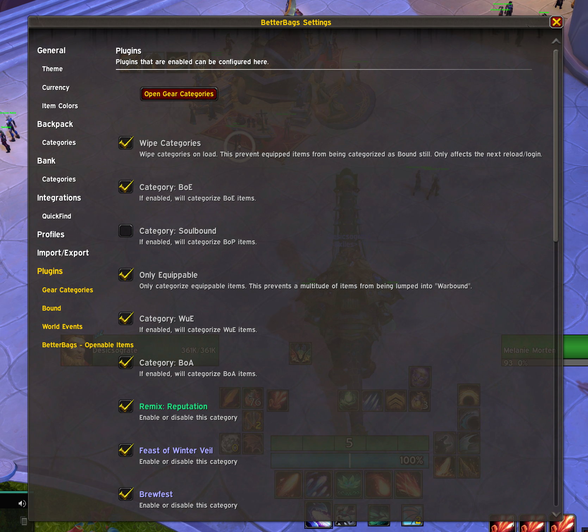
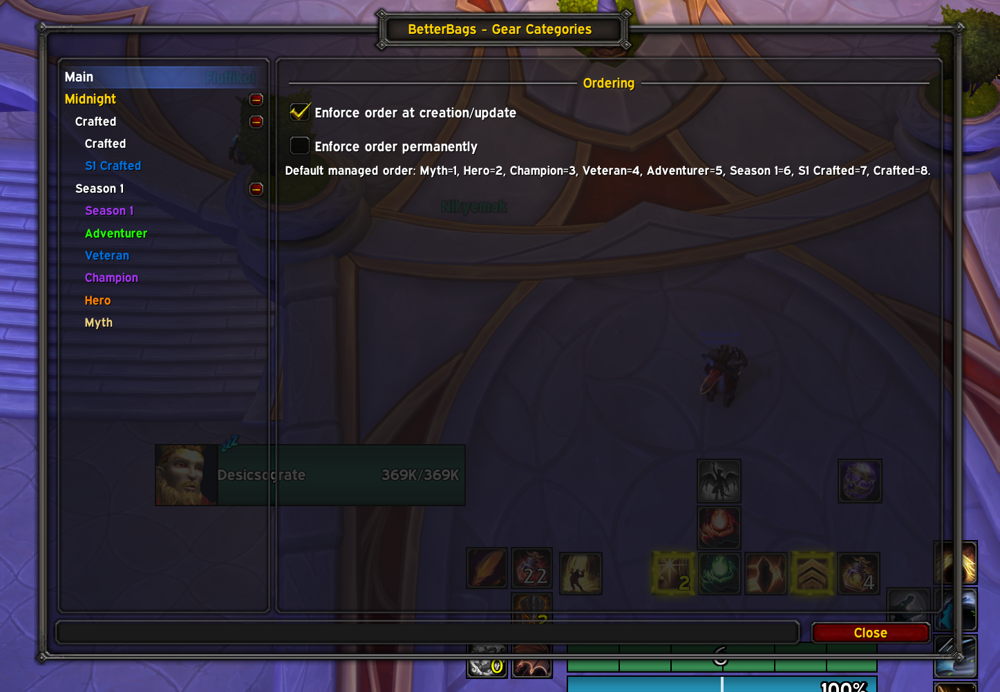
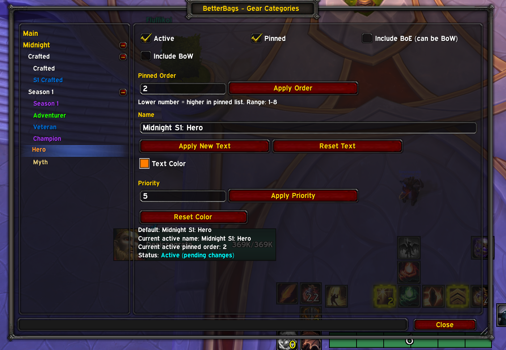
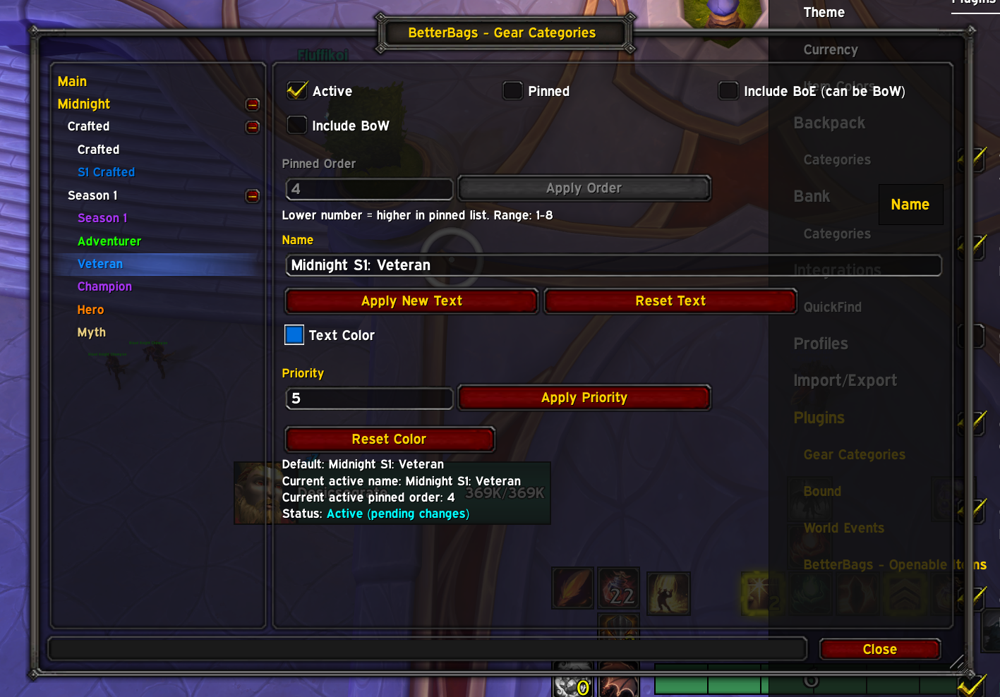
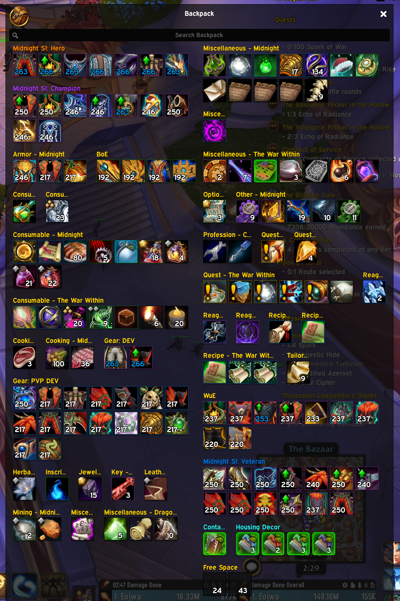
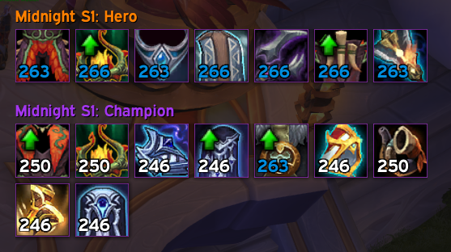

<!-- Buttons -->

[![Wago](https://img.shields.io/badge/Wago-Download-c1272d?style=for-the-badge&logo=data:image/svg%2Bxml;base64,PHN2ZyB4bWxucz0iaHR0cDovL3d3dy53My5vcmcvMjAwMC9zdmciIHZpZXdCb3g9IjAgMCA1NDEuNyAzMTEuNiI%2BPGRlZnM%2BPHN0eWxlPi5jbHMtMXtmaWxsOiNmZmY7fS5jbHMtMntmaWxsOiNjMTI3MmQ7fTwvc3R5bGU%2BPC9kZWZzPjxnIGlkPSJMYXllcl8yIiBkYXRhLW5hbWU9IkxheWVyIDIiPjxnIGlkPSJMYXllcl8xLTIiIGRhdGEtbmFtZT0iTGF5ZXIgMSI%2BPHBhdGggY2xhc3M9ImNscy0xIiBkPSJNMjMwLjgsMTQwLjZoNzkuOGE3Ny4xMSw3Ny4xMSwwLDAsMSw2MC44LTYwLjdVMEExNTYuMTMsMTU2LjEzLDAsMCwwLDIzMC44LDE0MC42WiIvPjxwYXRoIGNsYXNzPSJjbHMtMiIgZD0iTTQ2MS45LDE0MC42aDc5LjhBMTU2LjEzLDE1Ni4xMywwLDAsMCw0MDEuMSwwVjc5LjhBNzcuMSw3Ny4xLDAsMCwxLDQ2MS45LDE0MC42WiIvPjxwYXRoIGNsYXNzPSJjbHMtMSIgZD0iTTMxMC43LDE3MC45YzAtLjIuMS0uNC4xLS42aC04MGExLjI3LDEuMjcsMCwwLDAsLjEuNiw3Ny4wNiw3Ny4wNiwwLDAsMS0xNTEuMS0uNkgwYTE1Ni4yNCwxNTYuMjQsMCwwLDAsMjcxLDkwLjMsMTU1LjM4LDE1NS4zOCwwLDAsMCwxMDAuNiw1MC4zVjIzMUE3Ni45Myw3Ni45MywwLDAsMSwzMTAuNywxNzAuOVoiLz48cGF0aCBjbGFzcz0iY2xzLTEiIGQ9Ik00MDEuMSwyMzEuMVYzMTFBMTU2LjEzLDE1Ni4xMywwLDAsMCw1NDEuNywxNzAuNEg0NjEuOUE3Ny4xMSw3Ny4xMSwwLDAsMSw0MDEuMSwyMzEuMVoiLz48L2c%2BPC9nPjwvc3ZnPg%3D%3D)](https://addons.wago.io/addons/ultimate-castbars)

# BetterBags - Gear Categories

BetterBags - Gear Categories extends BetterBags with gear categorisation for the **Midnight** expansion, with a focus on clean track-based sorting, crafted gear grouping, and user-controlled category behaviour.

It is designed to make seasonal gear easier to manage inside BetterBags without forcing a one-size-fits-all setup. You can enable only the categories you want, rename them, recolor them, control their BetterBags priority, and pin and order them inside BetterBags’ pinned section.

  

The addon currently focuses on **Midnight Season 1** categories, but it is built with future growth in mind. Support for **future seasons** is planned, and additional category options may be added over time based on user requests. That said, the addon’s scope remains focused on **gear categorisation within BetterBags**.

The addon idea was inspired by another project called **BetterBags_GearTracks** by ZeptoGnome:  
[BetterBags_GearTracks](https://github.com/zeptognome/BetterBags_GearTracks)

---

## Features

### Category Support

Adds BetterBags gear categories for the Midnight expansion, grouped into **Crafted** and **Season 1** collections.

Supported categories currently include:

- **Crafted**
- **S1 Crafted**
- **Season 1**
- **Adventurer**
- **Veteran**
- **Champion**
- **Hero**
- **Myth**

### BetterBags Integration

- Adds a BetterBags plugin entry called **Gear Categories**
- Includes an **Open Gear Categories** button to open the full config window
- Lets you enable or disable each category individually
- Lets you keep categories pinned in BetterBags’ pinned section
- Lets you assign an explicit pinned display order to each pinned category
- Refreshes BetterBags after changes so the bag view updates immediately

  

### Per-Category Customisation

Each category can be customised independently:

- Custom category name
- Custom text colour for the category label
- Custom BetterBags priority value
- Custom pinned order value for pinned sections
- One-click apply actions for pending changes
- One-click reset actions for name and colour

### Status Feedback

The config UI provides clear per-category status text, including:

- Active
- Inactive
- Loading
- Has unapplied changes

### Bind Filters

Includes optional filters for bind behaviour:

- **Include BoE** (can be BoW)
- **Include BoW**

By default, BoE and Warbound-style items are excluded unless you explicitly enable them.

---

## Ordering and Priority

This addon now supports two separate concepts that are important to keep distinct:

### 1. BetterBags Priority

Priority controls **which category wins an item** when more than one category matches the same item.

It does **not** control where the category appears in the visible BetterBags section list.

All categories now default to priority **5**.  
You can still change priority per category if you want different category-match behaviour.

### 2. Pinned Order

Pinned order controls **where the category appears in BetterBags’ pinned section**.

This only applies when the category is **pinned**. If the category is not pinned, BetterBags falls back to its normal section sorting rules and the addon cannot force a custom visible position for that section.

Each category has a pinned-order input in its config panel. That input is disabled unless the category is pinned.

Lower number = higher in the pinned list.

Default managed order:

- **Myth** = 1
- **Hero** = 2
- **Champion** = 3
- **Veteran** = 4
- **Adventurer** = 5
- **Season 1** = 6
- **S1 Crafted** = 7
- **Crafted** = 8

### Main Ordering Toggles

In the main config window, the addon provides two ordering toggles:

- **Enforce order at creation/update**  
  Writes your configured pinned order when the addon creates or updates one of its managed categories.

- **Enforce order permanently**  
  Reapplies the managed pinned order while the addon is running, so later category changes can be kept in the intended order as well.

This separation lets you choose between a lighter-touch ordering mode and a persistent ordering mode.

  

---

## How It Works

The addon uses BetterBags search categories backed by **bonusid queries** to identify supported gear tracks and crafted gear.

It provides separate track categories for:

- Adventurer
- Veteran
- Champion
- Hero
- Myth

It also provides crafted categories for:

- **Midnight Crafted**
- **Midnight S1: Crafted**

The combined **Season 1** category is built dynamically from whichever track categories are currently active, so it reflects your enabled sub-tracks instead of using a static hardcoded grouping.

For pinned sections, the addon stores and reapplies explicit pinned sort positions through BetterBags’ custom pinned-section ordering data.

---

## Current Categories

### Crafted

General crafted gear for Midnight.

### S1 Crafted

Crafted gear specifically associated with Midnight Season 1.

### Season 1

A combined seasonal category that reflects the currently enabled Season 1 track categories.

### Track Categories

The following upgrade-track categories are supported individually:

- Adventurer
- Veteran
- Champion
- Hero
- Myth

This allows you to keep broader seasonal grouping enabled, use only specific tracks, or combine both approaches depending on how you prefer your bags to be organised.

  

---

## Configuration

The addon is built around category-level control inside BetterBags.

For each category, you can:

- Toggle it on or off
- Rename it
- Change its text colour
- Set its BetterBags priority
- Pin it into BetterBags’ pinned section
- Set its pinned display order
- Apply or reset pending changes from the config UI

In the main config page, you can also:

- Enable ordering enforcement at category creation/update
- Enable permanent ordering enforcement while the addon is running

This makes it easy to tailor the presentation without manually recreating categories in BetterBags.

---

## In Action

Here are a couple of examples of the addon at work inside BetterBags.

  

  

---

## Technical Behaviour

- Persists addon settings in **BBGT_DB**
- Initializes its saved database on load
- Automatically creates BetterBags custom categories when enabled
- Automatically deletes BetterBags custom categories when disabled
- Restores active categories automatically after login
- Retries setup until BetterBags’ category API is available
- Tracks active state separately from pending edits, enabling accurate “pending changes” status text
- Applies pinning to both backpack and bank custom section sort data
- Stores per-category pinned order values in the database
- Can enforce pinned ordering on creation/update or continuously while active
- Preserves compatibility with older saved-variable formats by migrating legacy category data into the current expansion/season structure

---

## Scope and Roadmap

### Current Scope

The current implementation is focused on **Midnight** and **Season 1** gear and crafted categories.

It is **not** currently intended to be a fully generic multi-expansion categorisation framework.

### Planned Direction

The addon is intended to support **future seasons** over time, and new category options or refinements may be added based on user feedback and requests.

That said, its long-term purpose remains focused and deliberate:

**BetterBags gear categorisation**, not general inventory automation or unrelated bag-management systems.

---

## Notes

This addon is best suited for players who want more control over how seasonal and crafted gear is grouped in BetterBags, while keeping the setup lightweight, readable, and easy to maintain.